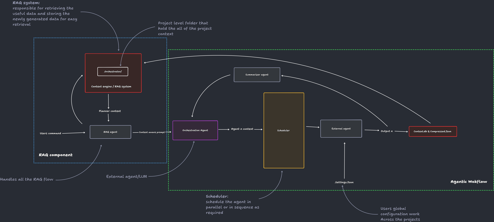
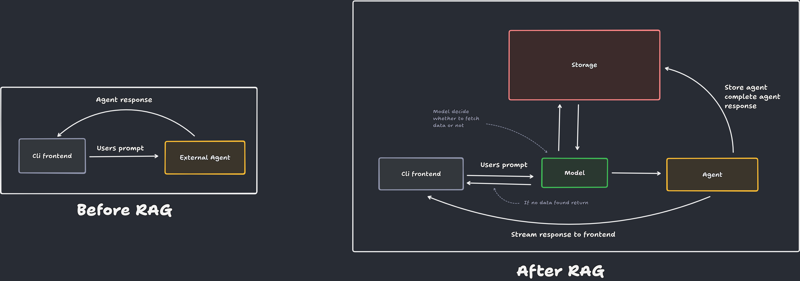
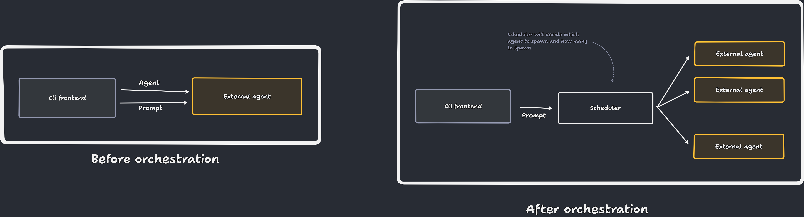
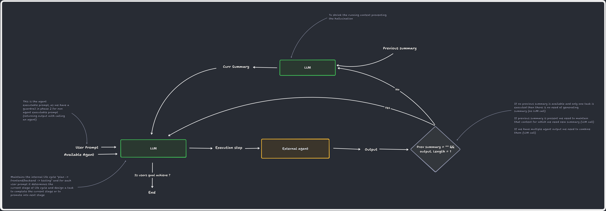
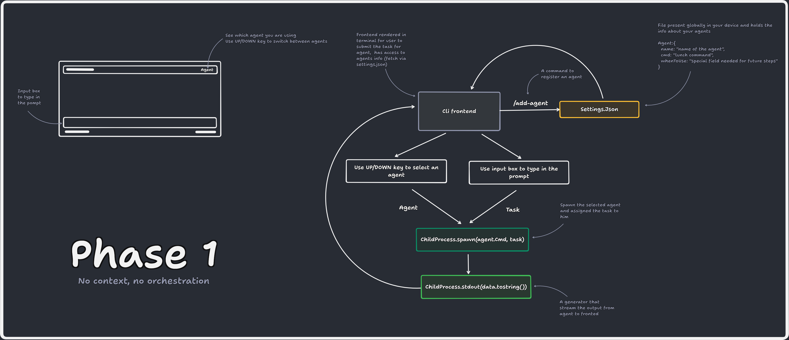
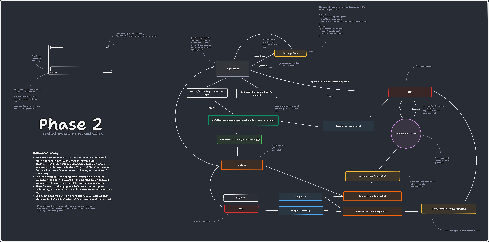

# Orchestrator

**Orchestrator** is a vendor-agnostic AI orchestration platform designed to coordinate multiple AI coding agents through a single, unified workflow.

Instead of developers manually interacting with different AI coding assistants, Orchestrator acts as a central intelligence layer that understands the user's objective, maintains a shared project context, and delegates tasks to the most suitable connected AI agents.

The platform is responsible for:
- Maintaining a centralized project context and memory.
- Breaking complex software development requests into manageable tasks.
- Distributing task-specific context to connected AI coding agents.
- Scheduling independent tasks for parallel execution whenever possible.
- Collecting and consolidating outputs into a unified project state.
- Keeping all connected agents synchronized without requiring users to repeatedly provide context.

Orchestrator does **not** replace existing AI coding assistants such as Claude Code, Codex, or Gemini CLI. Instead, it enables them to collaborate within a single, context-aware development workflow.

## Vision

To provide a unified orchestration layer for AI-assisted software development, allowing developers to seamlessly integrate multiple coding agents while eliminating manual context management and workflow coordination.

> **One Context. Multiple AI Coding Agents.**

---

# Project Setup
### Step 1: Make sure you have bun installed

```bash
bun --version
```
If bun is not installed then run following command to install it:
```bash
powershell -c "irm bun.sh/install.ps1 | iex"    # for windows
# OR
curl -fsSL https://bun.sh/install | bash    # for mac or linux
```
> Why Bun?
>
> `OpenTUI` is not a pure JavaScript library. It's renderer is written in `Zig` (a general-purpose programming language) and accessed through FFI (Foreign Function Interface).
>
> While `Node.js` can run `OpenTUI` only with **`Node.js 26.4+`** and `--experimental-ffi`, `Bun` provides built-in FFI support out of the box, making setup much simpler.

### Step 2: Clone the Repository
```bash
git clone https://github.com/Yranshevare/Orchestrator.git

cd Orchestrator
```
### Step 3: Install Dependencies
```bash
bun install
```
### Step 4: Run the Project
```bash
bun run dev
```
> This launches the Orchestrator Terminal UI.

### Development Environment

The project works without a `.env` file and connects to the **production** environment by default.

To use the **development environment**:
1. Create a `.env` file at the root of the project
2. Add following line into that `.env` file
```js 
RUNTIME="dev"
```
This gives you access to:
| Feature | Description |
|---------|-------------|
| Terminal Console (Ctrl + t) | Enables console output for debugging (`console.log`, etc.). |
| Experimental features | Access to features currently under development. |
| `./demo` Folder| When you ask the agent to perform a task, it operates inside the `./demo` folder. Make sure this folder exists at the root of the project. |


### To Run Orchestrator in Other Workspaces

To use Orchestrator in different workspaces, follow these steps:

1. Copy the path of the `bin` folder located at the root of the project.
2. Add the copied path to your system's **Environment Variables**.
3. Open a terminal in any workspace where you want to run Orchestrator.
4. Run the following command:

```bash
orc
```

Orchestrator will now open in the current workspace.

> **Note:** When Orchestrator is launched using `orc` from another workspace, it checks for the `.env` file in the **current workspace**.
>
> * If the workspace contains `.env` with `RUNTIME="dev"`, Orchestrator connects to the **development environment**.
> * If the workspace does not contain a `.env` file, Orchestrator uses the **production environment** by default.
> * The `.env` file in the **Orchestrator project directory** is ignored when running `orc` from another workspace.


---

# Available commands
Type `/` in input box to access the list available commands

| No. | Command                                                | Description                               | Example                                                               |
| :-: | ------------------------------------------------------ | ----------------------------------------- | --------------------------------------------------------------------- |
|  1  | `/exit`                                                | Exit the Terminal UI.                     | `/exit`                                                               |
|  2  | `/agent`                                               | List all registered agents.               | `/agent`                                                              |
|  3  | `/agent <name>`                                        | Show details of a specific agent.         | `/agent claude`                                                       |
|  4  | `/agent-add <name> "<launch-command>" "<when-to-use>"` | Register a new AI agent.                  | `/agent-add claude "ollama launch claude" "use for complex problems"` |
|  5  | `/agent-update <name> --key value`                     | Update an existing agent's configuration. | `/agent-update claude --name claude_with_ollama`                      |
|  6  | `/agent-delete <name>`                                 | Delete a registered agent.                | `/agent-delete claude`                                                |
| 7 | `/provider` | configure LLM provider | `/provider` |
| 8 | `/model` | switch between the LLMs | `/model` |
| 9 | `/toggle-orchestrator` | switch between auto/manual orchestrator | `/toggle-orchestrator` |

---

# Keyboard Events
| keys | use for|
| --- | --- |
| up / down arrow | switch between the agents  if orchestrator is off| 
| Ctrl + t | to access the in terminal console (only for development environment) |
| Enter | submit  |
| Tab | accept | 

---

# overall architecture



---
# RAG architecture (Phase 2)




---
# Orchestration Workflow (Phase 3)





---

# Phase-Wise Implementation

To make development easier and more manageable, we have divided the overall project into **three major phases**. Each phase focuses on solving one key problem and gradually introduces more advanced functionality.

### Phase 1: No Context, No Orchestration

In this phase, the agent has no memory of previous tasks. Every prompt is treated as a fresh request, so the agent cannot remember what it did earlier.

Additionally, there is no orchestration. The user must manually select which external coding agent will handle each task.



### Phase 2: Context, No Orchestration

In this phase, the agent maintains the context of previous tasks using RAG, allowing it to remember what has already been done and understand the current state of the project.

However, orchestration is still not implemented. The user must manually select the external coding agent for each task.



### Phase 3: Context, Orchestration

In the final phase, the agent combines **project context management with automated orchestration**.

The user only needs to provide a prompt. The agent will:

* Understand the project's current context.
* Break the task into smaller subtasks.
* Select and assign subtasks to the most suitable available external coding agents.
* Manage and coordinate their execution.


This phase aims to reduce manual effort and make the development workflow more efficient.


---